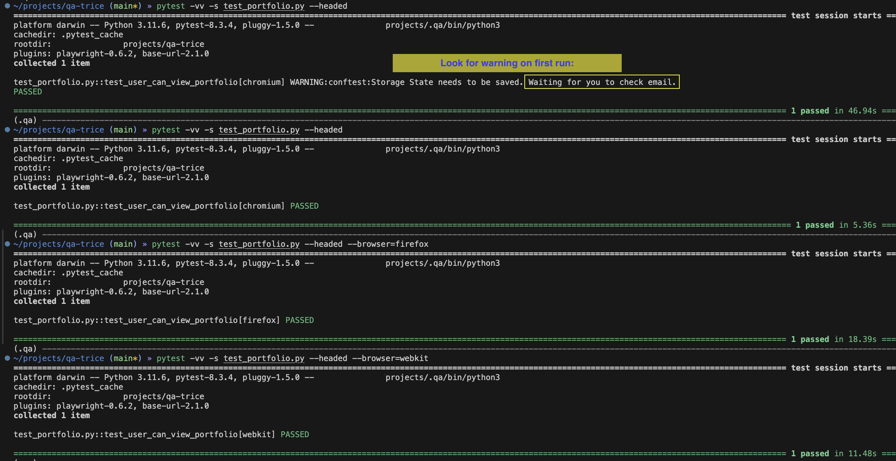

# Playwright Python Login Demo
Login and validate portfolio amount using the [Playwright Pytest framework](https://playwright.dev/python/docs/intro).

# Known Issues / Notes
 - "Device Approval" via email is requred during the first run:
    1. On first execution, the test will pause and wait for you to approve the device via email.
    2. After approval, the test will continue and pass.
    3. Subsequent runs will utilize the stored session and should not require device approval.

# Setup

> All commands from root of project:

1. Using the example `env_example` file, create a `.env` file
    ```bash
    cp env_example .env
    ```
2. Customize the `.env` file with your own credentials, base_url and portfolio value.

   - Ensure there are no leading or trailing spaces around the = sign in the .env file
   - To later run with different parameteres, modify the `.env` file and re-source it:
        ```bash
        . .env
        ```


1. Activate [Virtual Environment (venv)](https://packaging.python.org/guides/installing-using-pip-and-virtual-environments/)

    This step is optional but it is recommended to create a venv to isolate packages from your global python installation.

    ```bash

    python3 -m venv .qa
    
    source .qa/bin/activate
    ```

1. Install dependencies
    ```bash
    pip install -r requirements.txt
    ```
    
# Run tests

```bash
# First run you should see: WARNING:conftest:Storage State needs to be saved. Waiting for you to check email.
# Script will wait for you to approve the device via email.
pytest -vv -s test_portfolio.py --headed

# If you want to run with debugger/inspector    
PWDEBUG=1 pytest -s test_portfolio.py --headed
```

### Run with other browers (Default is chromium)
```bash
# add --browser=[firefox|webkit] to the command
pytest -vv -s test_portfolio.py --headed --browser=firefox
```


# Troubleshooting

If you get the follwing error, run `playwright install` as instructed.

```bash
E           ║ Looks like Playwright was just installed or updated.       ║
E           ║ Please run the following command to download new browsers: ║
E           ║                                                            ║
E           ║     playwright install    
```

# Expected Output
<a href="expected_output.png">
    
</a>